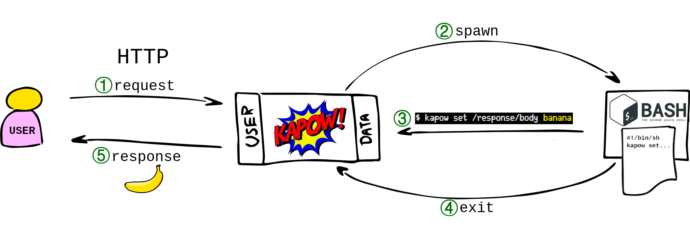

Request Life Cycle
==================

This section describes the sequence of events happening for each request
answered by the `HTTP User Interface`.

1. request
----------

The user makes a request to the `HTTP User Interface`.

- The request is matched against the route table.

- :program:`kapow` provides a `HANDLER_ID` to identify this request and don't
  mix it with other requests that could be running concurrently.

2. spawn
--------

:program:`kapow` spawns the executable specified as entrypoint in the matching
route.

The default entrypoint is ``/bin/sh``; let's focus on this workflow.

The spawned entrypoint is run with the following variables added to its
environment:

- :envvar:`KAPOW_HANDLER_ID`: Containing the `HANDLER_ID`
- :envvar:`KAPOW_DATAAPI_URL`: With the URL of the `HTTP Data Interface`
- :envvar:`KAPOW_CONTROLAPI_URL`: With the URL of the `HTTP Control Interface`

3. ``kapow set /response/body banana``
--------------------------------------

During the lifetime of the shell, the request and response resources are
available via these commands:

- ``kapow get /request/...``

- ``kapow set /response/...``

These commands use the aforementioned environment variables to read data
from the user request and to write the response.  They accept data either as
arguments or from :tech:`stdin`.

4. exit
-------

The shell dies.  Long live the shell!

5. response
-----------

:program:`kapow` finalizes the original request.  Enjoy your banana now.

.. todo::

   link to resource tree
