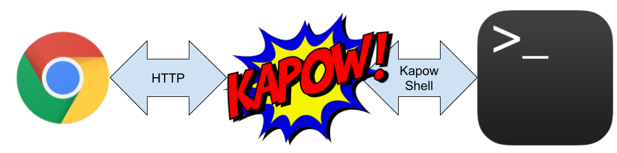

Welcome to Kapow!
=================

.. image:: https://circleci.com/gh/BBVA/kapow/tree/master.svg?style=svg
   :target: https://circleci.com/gh/BBVA/kapow/tree/master
.. image:: https://goreportcard.com/badge/github.com/bbva/kapow
   :target: https://goreportcard.com/report/github.com/bbva/kapow
.. image:: https://img.shields.io/github/issues/BBVA/kapow
   :target: https://github.com/BBVA/kapow/issues/
.. image:: https://img.shields.io/github/v/release/BBVA/kapow?include_prereleases
   :target: https://github.com/BBVA/kapow/releases

**If you can script it, you can HTTP it**

What's Kapow!
=============

Think in this **software** that you need but **only can runs in command line**. Kapow! lets you to **wrap it into an HTTP API without write any line of code**.

Want to know more? Check the :doc:`the_project/overview` section for a long explanation of what Kapow! does.

Authors
=======

**Kapow!** is being developed by `BBVA-Labs Security team members <https://github.com/BBVA/kapow/blob/master/AUTHORS.rst>`_.

License
=======

**Kapow!** is Open Source Software and available under the `Apache 2 license <https://raw.githubusercontent.com/BBVA/kapow/master/LICENSE>`_.

Contributions
=============

Contributions are of course welcome.  See `CONTRIBUTING <https://raw.githubusercontent.com/BBVA/kapow/blob/master/CONTRIBUTING.rst>`_ or skim existing tickets to see where you could help out.

Table of content
================

.. toctree::
   :maxdepth: 2
   :caption: The Project

   the_project/overview
   the_project/quickstart
   the_project/install-and-configure

.. toctree::
   :maxdepth: 2
   :caption: Usage examples

   examples/index

.. toctree::
   :maxdepth: 2
   :caption: Theory

   theory/interfaces
   theory/philosophy
   theory/request_life_cycle
   theory/resource_tree
   theory/route_matching
   theory/routes

.. toctree::
   :maxdepth: 2
   :caption: Tutorial

   tutorial/_brianstorm

Indices and tables
==================

* :ref:`genindex`
* :ref:`modindex`
* :ref:`search`
