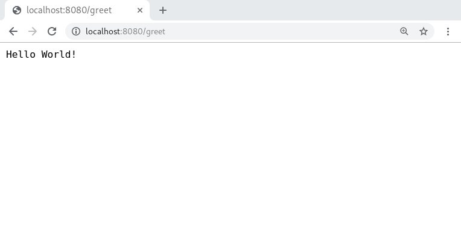

.. todo::

   Redo 

Hello World! -- *Kapow!* style
------------------------------

In a shell, the traditional `Hello World!` program would be ``echo "Hello World!"``.
Let's publish it through HTTP using *Kapow!*

- First you need a *script file* with the route that will publish your command, lets's call the file ``greet.sh`` and should contain the following code:

.. code-block:: bash

    kapow route add /greet -c 'echo "Hello World!" | kapow set /response/body'

- Start the *Kapow!* server with your script as an argument

.. code-block:: bash

    kapow server greet.sh

- Finally check that all is working as intended:

